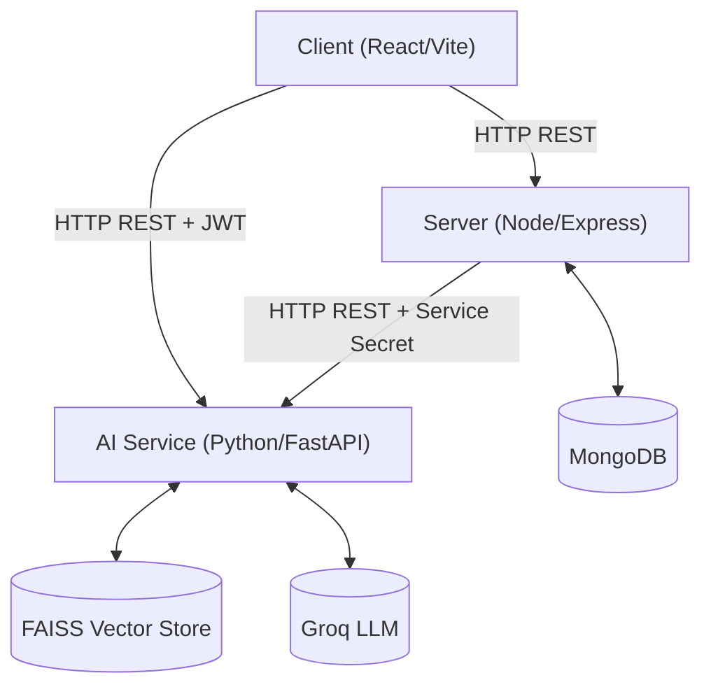

# Expense AI Tracker

A full-stack AI-powered expense tracking application separated into three independently deployable services.

## Architecture & Communication

This project uses a decoupled microservices architecture to enforce separation of concerns.



### Authentication Flow (JWT)
1. **Login**: User logs into the **Server**. The Server validates against MongoDB and signs a JWT (`JWT_SECRET`).
2. **Standard API**: Client sends `Authorization: Bearer <token>` to **Server** for all expense CRUD actions.
3. **AI Features**: Client sends `Authorization: Bearer <token>` to **AI Service** for semantic search and receipt scanning. **AI Service** independently verifies the token's signature using the same shared `JWT_SECRET`.
4. **Internal Sync**: When expenses change, the **Server** pushes updates to the **AI Service** (`/sync`) using a backend-only `SERVICE_SECRET`.

---

## Deployment Instructions

Do NOT use Docker Compose if you are deploying them to separate platforms.

### 1. Server (Backend API)
Deploy to a platform like **Render**, **Railway**, or **Heroku**.
- **Environment Variables**:
  - `PORT`: Server port (e.g., 5000)
  - `MONGODB_URI`: Your MongoDB connection string (e.g., MongoDB Atlas).
  - `JWT_SECRET`: A secure random string for JWT signing.
  - `SERVICE_SECRET`: A secure string for Server-to-AI communication.
  - `AI_SERVICE_URL`: The URL where your AI Service is deployed.
- **Run Locally**:
  ```bash
  cd server
  npm install
  npm run dev
  ```

### 2. AI Service (RAG Microservice)
Deploy to a platform that supports Python, such as **Render**.
- **Environment Variables**:
  - `GROQ_API_KEY`: Your Groq API key for LLM generation.
  - `JWT_SECRET`: Must perfectly match the Server's secret.
  - `SERVICE_SECRET`: Must perfectly match the Server's secret.
  - `SERVER_API_URL`: URL to fetch missing data (e.g. `https://my-server.onrender.com/api`).
  - `PORT`: (e.g., 8000)
- **Run Locally**:
  ```bash
  cd ai-service
  pip install -r requirements.txt
  uvicorn app.main:app --reload --port 8000
  ```

### 3. Client (Frontend)
Deploy to a platform like **Vercel** or **Netlify**.
- **Environment Variables**:
  - `VITE_API_URL`: The public URL of your deployed Server.
  - `VITE_AI_SERVICE_URL`: The public URL of your deployed AI Service.
- **Run Locally**:
  ```bash
  cd client
  npm install
  npm run dev
  ```

## Hardening & CI/CD
- **Testing**: React components are tested using `vitest` and `@testing-library/react`.
- **CI/CD**: GitHub Actions automatically run linting and tests across all services on pushes to `main`.
- **Rate Limiting & Caching**: The AI service implements in-memory caching for LLM requests and rate limits to prevent API abuse (10 requests/min per user). In a scaled production environment, these should be replaced with **Redis**.
